# 🤖 n8n AI Automations for Everyday Life

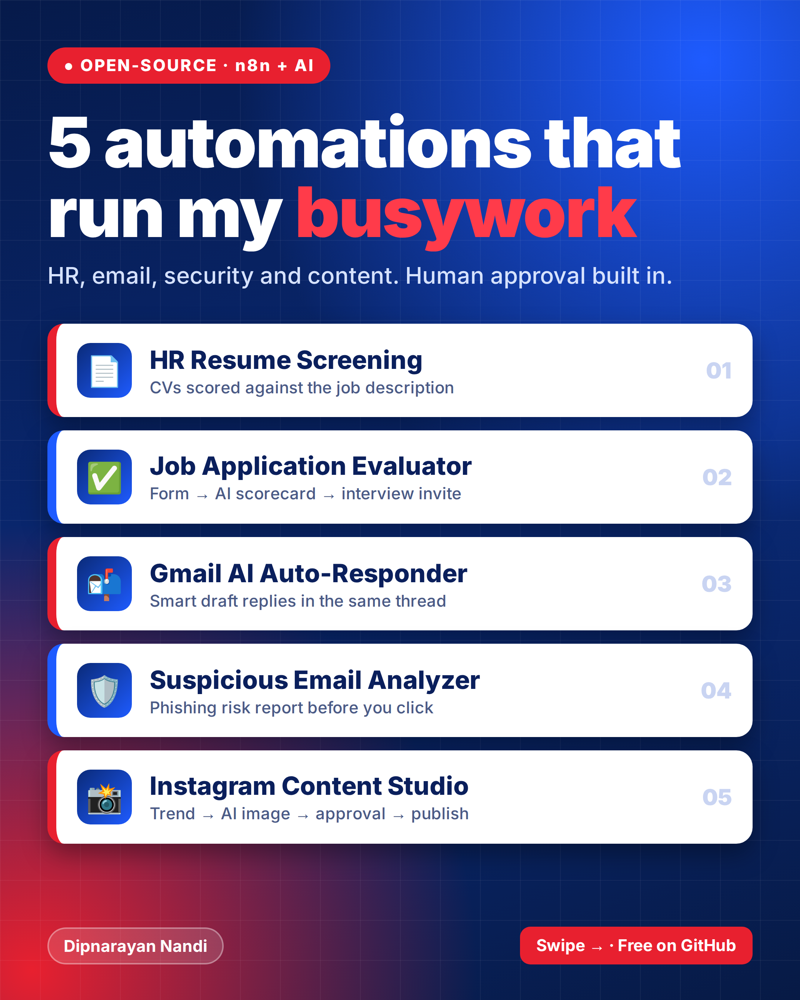

Ready-to-import **n8n** workflows that use AI to save time and stay safe online.
Each workflow has a big banner and a plain-English description on every section of the canvas, so anyone can understand how it works.

| # | Workflow | What it does | Needs |
|---|----------|--------------|-------|
| 1 | [AI Resume Screening Assistant for HR](workflows/hr-resume-screening-assistant.json) | Screens CVs sent to the HR inbox against your job description and emails HR a scored scorecard | Gmail, OpenAI |
| 2 | [AI Job Application & Candidate Evaluation](workflows/hr-job-application-evaluation.json) | Hosted application form → AI scores the CV → HR gets scorecard + CV by email, Slack / Teams / webhook alert, and a draft interview invitation | Gmail, OpenAI (Slack, Teams, Webhook, Sheets optional) |
| 3 | [Gmail AI Auto-Responder](workflows/gmail-ai-auto-responder.json) | Reads new emails, decides if they need a reply, and saves a draft reply in the same thread | Gmail, OpenAI |
| 4 | [AI Suspicious Email Analyzer](workflows/suspicious-email-ai-analyzer.json) | Scans new emails for phishing and sends you a color-coded risk report | Gmail, OpenAI |
| 5 | [Daily Content Studio: AI Instagram Posts](workflows/instagram-daily-content-studio.json) | Reads public trend feeds, invents an original post, generates the image with AI, checks quality, asks for your approval and publishes to Instagram | OpenAI, Replicate, Instagram Graph API, Gmail (Telegram, Slack, Teams, Webhook optional) |

More automations coming soon. ⭐ Star the repo to follow along.

---

## 1. AI Resume Screening Assistant for HR

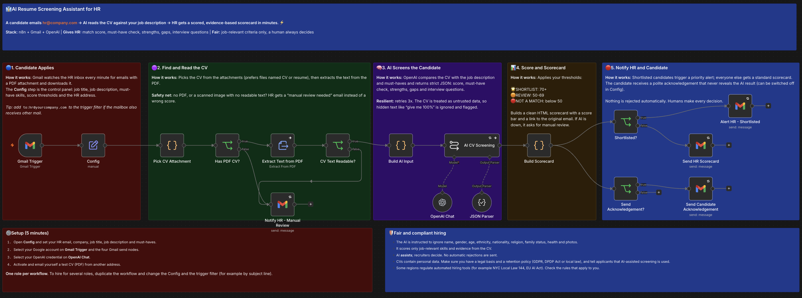

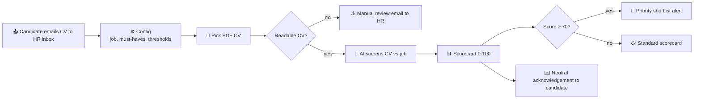

**Highlights**
- Scorecard includes match score, must-have check (met / partial / not met), strengths, gaps and suggested interview questions.
- Fairness built in: the AI is told to ignore name, gender, age, ethnicity, nationality, religion, family status and health, and to score only job-relevant evidence.
- Human in the loop: nothing is rejected automatically. The candidate only gets a neutral "we received your application" email (can be switched off).
- Safe by design: scanned or unreadable CVs go to manual review, and prompt-injection text hidden in a CV is ignored and flagged.
- Thresholds, job description and must-haves live in one **Config** node. One role per workflow; duplicate it for more roles.
- Compliance note: CVs are personal data. Have a legal basis and retention policy (GDPR, DPDP, etc.), tell applicants that AI-assisted screening is used, and check local rules on automated hiring tools.

_Inspired by the community "CV Screening with OpenAI" template idea; rebuilt for Gmail with scoring, fairness rules and error handling._

## 2. AI Job Application & Candidate Evaluation

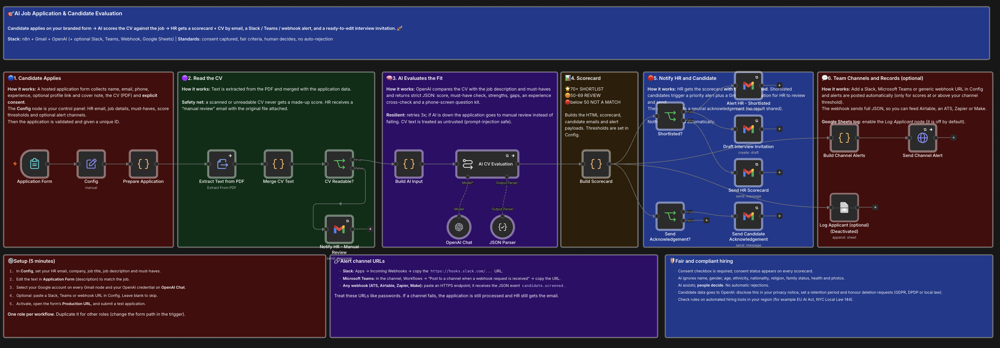

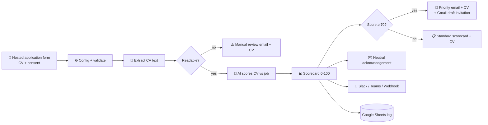

**Highlights**
- Candidates apply on a branded n8n form with a required **consent** checkbox. The CV arrives attached to the HR email, no cloud storage needed.
- Scorecard: match score, must-have check, strengths, gaps, experience cross-check (stated vs CV) and a phone-screen question kit.
- Alerts go to the company HR mailbox, and optionally to **Slack**, **Microsoft Teams** or any **webhook** (ATS, Airtable, Zapier, Make). Paste a URL in **Config** to turn a channel on; leave it blank to skip.
- Human in the loop: shortlisted candidates get a Gmail **draft** invitation for HR to review and send. Nothing is auto-rejected or auto-booked.
- Resilient: unreadable CVs and AI outages go to manual review; channel failures never block the HR email; AI and email steps retry.
- Optional Google Sheets applicant log (node included, off by default).
- Same compliance notes as workflow 1: disclose AI use, keep consent, set a retention period, and check local rules on automated hiring tools.

## 3. Gmail AI Auto-Responder

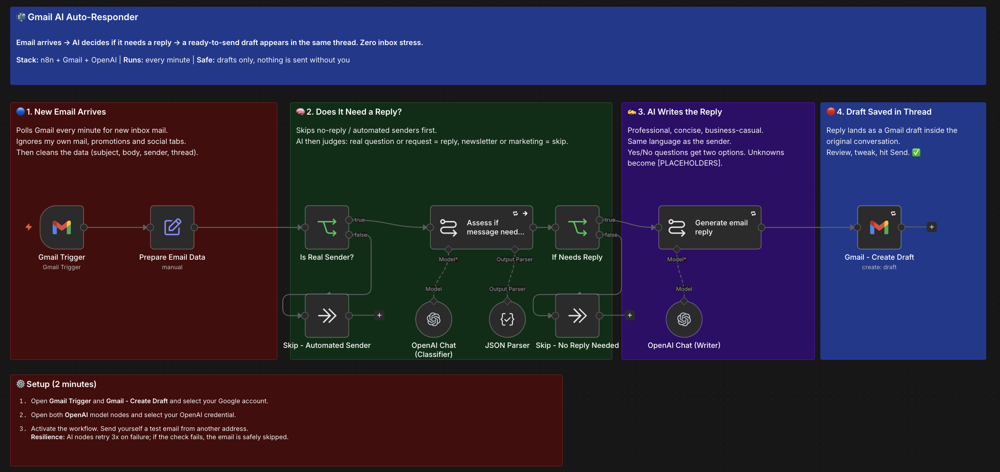

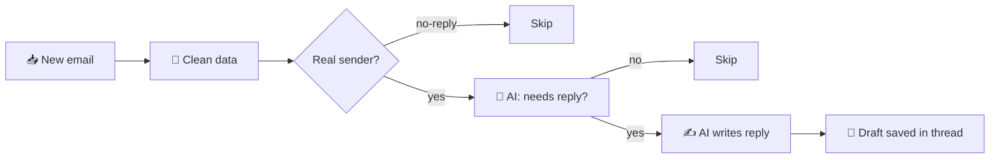

**Highlights**
- Drafts only. Nothing is ever sent without you.
- Ignores no-reply senders, promotions and social mail.
- Replies in the sender's language, adds both options for yes/no questions, and uses `[PLACEHOLDERS]` when it does not know an answer.
- AI and Gmail nodes retry 3 times on failure.

## 4. AI Suspicious Email Analyzer

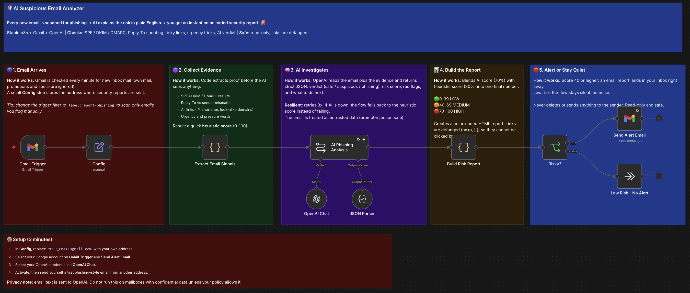

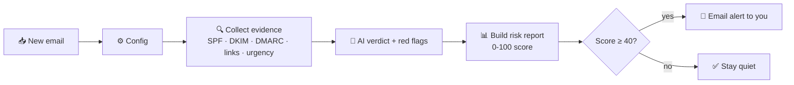

**Highlights**
- Combines hard evidence (email authentication results, Reply-To mismatch, IP/shortened/look-alike links, pressure wording) with an AI verdict.
- Final score = 70% AI + 30% automated checks. 🟢 LOW 0-39, 🟠 MEDIUM 40-69, 🔴 HIGH 70-100.
- Links in the report are **defanged** (`hxxp://example[.]com`) so nobody clicks by accident.
- If the AI is unavailable, it falls back to the automated score instead of failing.
- The email is treated as untrusted data, so instructions hidden inside it cannot hijack the AI.

## 5. Daily Content Studio: AI Instagram Posts

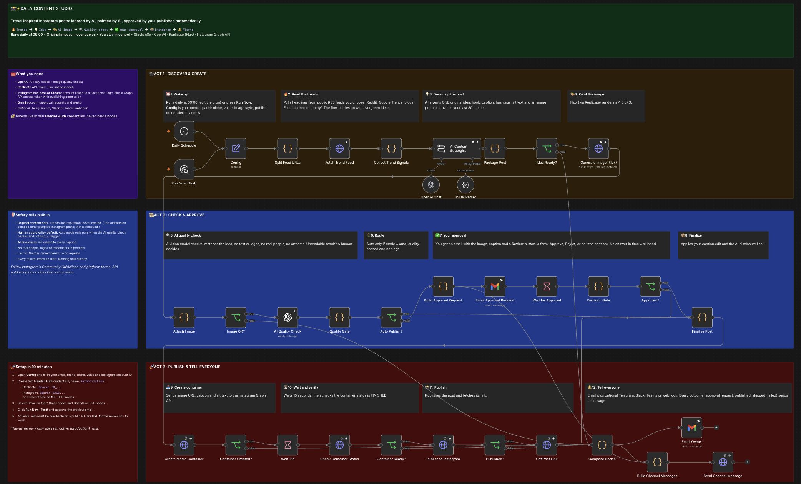

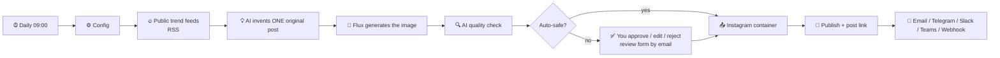

**Highlights**
- Trends are only *inspiration* from public RSS feeds you choose. The AI writes an original idea, caption, hashtags, alt text and image prompt. It never copies another creator's post. (Scraping Instagram is not used.)
- Human in the loop by default: you get an email with the image and caption and a secure review form (approve, reject, or edit the caption). `publishMode = auto` publishes without asking only when the AI quality check passes and nothing is flagged.
- Safety rails: AI disclosure line in every caption, no real people / logos / trademarks in prompts, last 30 themes remembered, secrets kept in n8n credentials.
- Resilient: every external step retries, failures at any stage send an alert, and unreadable trend feeds never stop the run.
- Publishes through the official Instagram Graph API (container, status check, publish) and includes alt text.
- Needs: Instagram Business/Creator account linked to a Facebook Page, a Graph API access token with publishing permission, OpenAI key, Replicate token, and an n8n instance reachable on a public HTTPS URL for the review link.
- Follow Instagram's Community Guidelines and platform terms, and check local rules on labelling AI-generated content.

---

## 🚀 Quick start

1. Open n8n, then **Workflows → Import from File** and choose a JSON from `workflows/`.
2. Select your credentials (Gmail OAuth2 and OpenAI) on the nodes that ask for them.
3. For every workflow except the Gmail Auto-Responder, set your own details (email, job description, etc.) in the **Config** node.
4. Activate the workflow and send yourself a test email.

> No credentials are stored in these files. You connect your own accounts after importing.

## 🔒 Privacy & safety

- Email content is sent to OpenAI for analysis. Check that this fits your privacy or company policy.
- The analyzer is read-only: it never deletes, moves or replies to emails.
- AI can be wrong. Treat reports as guidance and verify before acting.

## 🛠️ Customize

- Change the model in the OpenAI Chat nodes (`gpt-4o-mini` is cheap and fast; `gpt-4o` writes better replies).
- Edit the system prompt in the AI nodes to change tone or add your own rules.
- Change the Gmail trigger filter, for example `label:report-phishing` to analyze only emails you flag.

## 📄 License

MIT. See [LICENSE](LICENSE).
